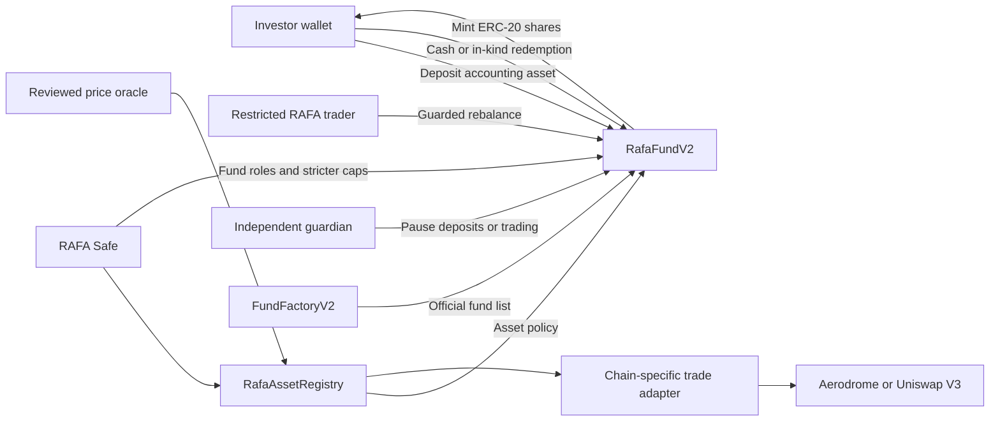

# RAFA Fund Protocol V2 architecture

## System model

## Chain-local asset registry

Base and Ethereum each receive an independent `RafaAssetRegistry`, owned by the
RAFA Safe. A configured policy binds one token to:

- admission, buy, and sell status flags;
- immutable-at-read token decimals;
- separate NAV and settlement price-age limits;
- a protocol-wide maximum exposure;
- an `IPriceOracle` implementation and `ITradeAdapter` implementation; and
- machine-readable asset-class and issuer identifiers.

The split status flags support incident response. RAFA can prevent new funds
from adding an asset, stop further buying, and keep selling enabled for an
orderly unwind. Existing funds read the registry on each trade and valuation,
so a protocol policy or exposure reduction applies without redeploying them.

Discovery is explicitly off-chain. Catalog files do not configure the registry,
and no discovery script has a Safe key or an automatic admission path.

## Base B20 compatibility

Coinbase B20 assets are native Base precompiles and may expose ERC-20 behavior
without normal EVM bytecode. `RafaAssetRegistry` therefore does not require
token bytecode, while it does require code at the configured oracle and adapter.
Operational review must call token methods on a mainnet fork before admission.

B20 prices incorporate a multiplier for dividends and stock splits. RAFA must
use the official total-return-aware feed, not a generic spot-equity quote. A
corporate-action or market-hours freeze stops `updatedAt` from advancing; the
strict settlement age then blocks deposits, cash exits, fees, and trades. The
RAFA monitor should disable admission/buys immediately when an issuer pause is
detected. In-kind exits remain available.

## Execution adapters

The fund never calls a DEX directly. The registry selects a reviewed adapter for
each asset, and the fund approves only the exact input amount for one call.

- Base uses `AerodromeAdapter`, whose owner enables a direct stable or volatile
  route between the accounting asset and one candidate asset.
- Ethereum uses `UniswapV3Adapter`, whose owner enables a direct pool fee tier.

Both adapters return output directly to the fund. The fund checks actual input
spent, actual output received, deadline, oracle-relative slippage, per-trade NAV
limit, and post-buy exposure. Adding another venue requires a new adapter that
implements `ITradeAdapter`; fund bytecode does not change.

## Deployment and official funds

Each vault is an immutable `RafaFundV2`. `FundFactoryV2` is an official-fund
registry instead of a bytecode factory, keeping contracts below EVM size limits
and avoiding upgrade authority. Registration checks the V2 implementation
marker, expected accounting asset, expected asset registry, and maximum
performance fee. The Safe must also verify bytecode and constructor arguments;
the marker alone is not proof of identity.

## Roles

| Role | Initial holder | Authority |
| --- | --- | --- |
| Asset registry owner | RAFA Safe | Protocol asset admission/status, oracle, adapter, freshness, and global cap. |
| Fund default admin | RAFA Safe | Select permitted assets, stricter caps, roles, metadata, and unsupported-token recovery. |
| Trader | Restricted RAFA automation key | Swap only between accounting asset and permitted assets within on-chain limits. |
| Guardian | Independent operations key or Safe | Pause deposits and fund trading; only admin unpauses. |
| Factory owner | RAFA Safe | Register and deactivate official funds. |
| Fee recipient | RAFA treasury/Safe | Receive newly minted performance-fee shares. |

Initially RAFA operates every fund and the Safe retains centralized policy
control. The RAFA token is not required for deposits, manager permissions, or
asset admission in this phase; governance can be introduced later without
making it a tradable portfolio asset by default.

## NAV, settlement, and exits

`totalAssets` values idle accounting tokens plus each active holding using the
policy's NAV age. `settlementTotalAssets` uses the stricter trade age and is
required before deposits, cash exits, fee crystallization, and trades. Invalid
or stale data reverts instead of valuing an asset at zero.

Standard ERC-4626 withdrawals use idle accounting-asset liquidity. `redeemInKind`
burns shares and transfers a proportional slice of every held token without a
DEX or oracle, including during price, venue, or pause incidents. Recipients may
still be subject to issuer transfer restrictions.

Performance fees mint shares only on profit above a per-share high-water mark.
They accrue before standard entry/exit and can be called permissionlessly. If
pricing is unavailable, in-kind redemption skips fee accrual and emits an event
rather than trapping investors.

## Indexing

The investor application should index factory registration/status, ERC-4626
deposits/withdrawals, fund-share transfers, trades, in-kind redemptions, fees,
and registry policy/status events. Historical performance must use price per
share rather than TVL so flows are not mistaken for returns.
