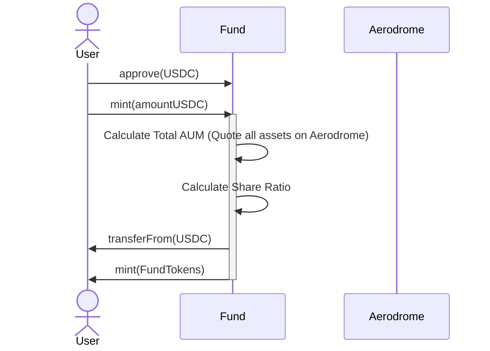

# RAFAFund Protocol Architecture

## 1. Executive Summary
The **RAFAFund Protocol** is a decentralized asset management infrastructure built on the Base L2 blockchain. It allows fund managers (AI Agents or Humans) to deploy and manage on-chain ETFs (Exchange Traded Funds). 

Each Fund is a compliant ERC20 token representing a share of a basket of underlying assets. The protocol integrates natively with **Aerodrome Finance** for liquidity execution and asset valuation.

## 2. System Context
The protocol consists of a Factory registry and individual Fund instances.

```mermaid
graph TD
    User[Investor] -->|Mint/Burn| FundToken[FundToken (ERC20)]
    Manager[AI Agent / Manager] -->|Trade/Rebalance| FundToken
    FundToken -->|Swap/Quote| Aerodrome[Aerodrome Router]
    FundToken -->|Oracle Updates| Chainlink[Price Oracles (Optional)]
    Factory[FundFactory] -->|Deploys| FundToken
```

## 3. Core Components

### 3.1 FundFactory (FundFactory.sol)
**Responsibility:** Deployment registry and configuration governance.

- **Registry:** Maintains an index of all legitimate funds created by the protocol.
- **Deployment:** Uses standard new deployment to ensure unique state for every fund (avoiding proxy complexity for security).
- **Indexing:** Emits FundCreated events for subgraph ingestion.

### 3.2 FundToken (BaseETF.sol)
**Responsibility:** Vault management, NAV calculation, and share issuance.

- **Token Standard:** ERC20 (Mintable/Burnable).
- **Accounting:** Calculates Net Asset Value (NAV) in USDC terms.
- **Liquidity Strategy:** 
  - Volatile Pools: Standard $x \times y = k$ (e.g., WETH/USDC).
  - Stable Pools: $x^3y + xy^3 = k$ (e.g., USDC/DAI).

## 4. Operational Flows

### 4.1 Minting (Deposit)
Users deposit a stablecoin (USDC) to receive Fund Tokens. The exchange rate is determined by the current NAV.

$$ Shares = \frac{Deposit_{USDC} \times TotalSupply}{TotalAUM_{USDC}} $$



### 4.2 Trading (Active Management)
The Manager (AI Agent) executes trades to rebalance the portfolio.

- **Access Control:** Only MANAGER_ROLE can execute trades.
- **Safety:** Trades are atomic; assets never leave the contract during a swap.
- **Routing:** Intelligent routing via Aerodrome's Router.

### 4.3 Redemption (Burn)
Users can exit the fund in two modes:

- **Liquidate (Standard):** The contract sells the user's portion of assets for USDC and sends USDC.
- **In-Kind (Advanced):** The contract transfers the underlying assets directly to the user (avoids slippage).

## 5. Data Models & Storage

### Asset Configuration (AssetConfig)
Every asset held by a fund is tracked in a mapping with specific configuration flags.

| Field | Type | Description |
|-------|------|-------------|
| isSupported | bool | Whitelist status of the token. |
| isStablePair | bool | true if liquidity is in Aerodrome Stable Pool (e.g., DAI/USDC). |
| manualPrice | uint256 | Backup price (18 decimals) if oracleMode is enabled. |

### Global State
- **Active Assets:** An array `address[]` tracking all tokens currently held to allow iteration during NAV calculation.
- **Limits:** MAX_ASSETS (default 10) prevents gas limit loops.

## 6. Security Considerations

### 6.1 Valuation Attacks (Flash Loans)
**Risk:** An attacker flash-loans capital to manipulate an asset's price on Aerodrome, then Mints/Burns FundTokens at a distorted NAV.

**Mitigation:** 
- **Oracle Mode:** Enable Chainlink feeds for high-value mints.
- **Slippage Protection:** The trade function requires minAmountOut.

### 6.2 Gas Limits (DoS)
**Risk:** If a fund holds too many tokens (e.g., 50+), the loop to calculate NAV will exceed the block gas limit, locking funds.

**Mitigation:** 
- **Hard Cap:** MAX_ASSETS constant limits portfolio size to 10 assets.

## 7. Directory Structure

```
├── contracts
│   ├── core
│   │   ├── FundFactory.sol       # Main Entrypoint
│   │   └── BaseETF.sol           # The Fund Logic
│   ├── interfaces
│   │   └── IAerodromeRouter.sol  # Aerodrome Interaction
│   └── libraries
│       └── MathUtils.sol         # Safe math wrappers
├── scripts
│   └── deploy.ts                 # Hardhat deployment
├── test
│   └── FundFlow.spec.ts          # Mainnet Fork tests
└── ARCHITECTURE.md
```