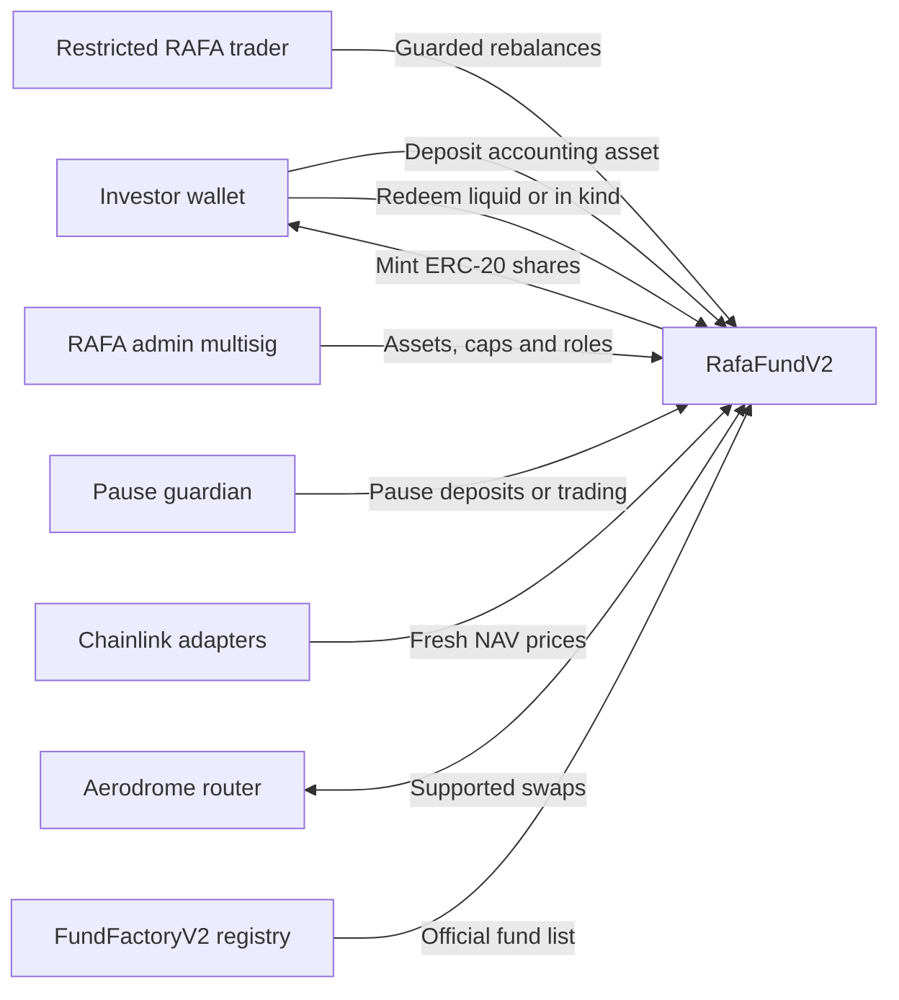

# RAFA Fund Protocol V2 architecture

## System model

## Deployment and registry

Each vault is an immutable `RafaFundV2` deployment. `FundFactoryV2` deliberately acts as a registry rather than embedding vault creation bytecode. This keeps both contracts below EVM size limits and avoids proxy upgrade authority.

Only the registry owner can register a fund. Registration confirms the V2 implementation marker, the registry's accounting asset and Aerodrome router, and that the performance fee does not exceed the registry maximum. The marker is a compatibility check rather than proof of bytecode identity, so the owner must also verify the deployed bytecode and constructor arguments before registration. The registry owner should be a RAFA Safe multisig.

## Roles

| Role | Intended holder | Authority |
| --- | --- | --- |
| Default admin | RAFA Safe | Manage assets, caps, roles, metadata and recovery of unsupported tokens. Admin transfer is two-step and delayed. |
| Trader | Restricted automation key | Swap only between the accounting asset and supported assets within on-chain risk limits. |
| Guardian | Independent operations key or Safe | Pause new deposits and trading. Only the admin can unpause. |
| Fee recipient | RAFA treasury/Safe | Receive newly minted performance-fee shares. |

The trader cannot transfer vault assets to an arbitrary recipient, change supported assets, change prices, or grant roles.

## Deposits and shares

The accounting asset is the ERC-4626 asset, initially expected to be USDC on Base. Fund shares use 18 decimals through ERC-4626's virtual-share offset.

Deposits are valued against the full oracle-priced portfolio. The web application should call `previewDeposit` and submit `depositWithSlippage` with a user-approved `minSharesOut`. Deposits stop when paused or when the fund reaches its configured NAV cap.

## NAV and pricing

`totalAssets` returns the accounting-asset value of idle accounting tokens plus every active supported asset. Each asset has:

- a price-oracle adapter;
- a maximum permitted price age;
- token decimals cached at configuration time;
- an Aerodrome stable/volatile route flag; and
- a maximum share of fund NAV.

`ChainlinkPriceOracle` divides an asset/USD feed by the accounting-asset/USD feed. On Base it should also receive the official L2 sequencer uptime feed and a non-zero grace period. Stale or invalid data causes valuation-dependent operations to revert instead of silently valuing an asset at zero.

## Trading and risk controls

Every trade must:

1. Be submitted by `TRADER_ROLE` while trading is active.
2. Use the accounting asset as one side of the pair.
3. Use a supported asset as the other side.
4. Remain below the maximum fraction of current NAV allowed per trade.
5. Set `minAmountOut` no lower than the oracle quote minus the fund's maximum slippage.
6. Leave purchased-asset exposure below that asset's configured concentration limit.
7. Send all output back to the vault.

The transaction reverts atomically if any post-trade exposure check fails.

## Performance fees

Fees use a per-share high-water mark. When NAV per share exceeds the mark, the fund mints enough shares to the fee recipient to represent the configured percentage of profit. The high-water mark is then updated to the post-fee share price.

Fees crystallize before standard deposits and redemptions and can also be crystallized permissionlessly. In-kind redemption attempts accrual first; if an oracle is unavailable, the redemption proceeds and emits `PerformanceFeeAccrualSkipped` so investor exit is not blocked.

## Redemptions

Standard ERC-4626 `withdraw` and `redeem` calls are limited to idle accounting-asset liquidity. The UI must use `maxWithdraw`/`maxRedeem` and `redeemWithSlippage`.

`redeemInKind` burns shares and transfers a proportional amount of the accounting asset and every supported token. It does not require a DEX and continues to function during deposit/trading pauses and oracle failures.

## Indexing

The investor application can index:

- registry `FundCreated` and `FundStatusUpdated` events;
- ERC-4626 `Deposit` and `Withdraw` events;
- ERC-20 fund-share transfers;
- `TradeExecuted`, `InKindRedemption`, and `PerformanceFeeAccrued` events; and
- periodic `totalAssets`, `totalSupply`, and `pricePerShareWad` snapshots.

Historical fund performance should be derived from price per share, not raw TVL, so investor deposits and redemptions are not mistaken for returns.
